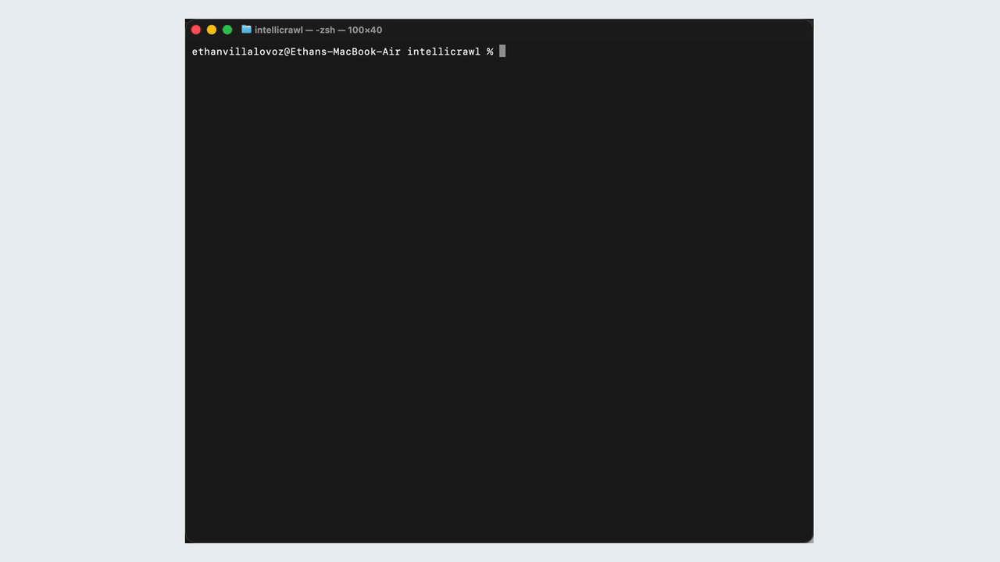
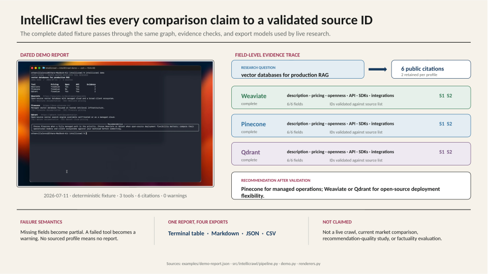

# IntelliCrawl

[](https://github.com/ethanvillalovoz/intellicrawl/actions/workflows/ci.yml)
[](https://github.com/ethanvillalovoz/intellicrawl/releases/latest)
[](https://www.python.org/)
[](LICENSE)

I built IntelliCrawl for a specific research chore: compare a handful of developer tools without losing track of which source supports each claim. When the evidence does not answer something, the report leaves it unknown.

[](docs/media/intellicrawl-terminal.mp4)

The clip runs the installed CLI in macOS Terminal against the deterministic no-key provider. [MP4 recording](docs/media/intellicrawl-terminal.mp4) · [poster frame](docs/media/intellicrawl-terminal.webp)

Under the hood, a LangGraph workflow discovers candidates, profiles them concurrently, validates source IDs, and exports the same report as a terminal table, Markdown, JSON, or CSV.

## Try It Without API Keys

Install the tagged wheel and run the deterministic research pipeline:

```sh
python -m pip install \
  https://github.com/ethanvillalovoz/intellicrawl/releases/download/v2.0.0/intellicrawl-2.0.0-py3-none-any.whl
intellicrawl demo
```

The deterministic demo exercises the same LangGraph pipeline and report models as live research. Its dated comparison is reproducible and available as [Markdown](examples/demo-report.md), [JSON](examples/demo-report.json), and [CSV](examples/demo-report.csv).

## Run Live Research

```sh
python -m pip install -e ".[live]"
cp .env.example .env
# Add FIRECRAWL_API_KEY and OPENAI_API_KEY to .env.
intellicrawl research "vector databases for production RAG"
```

Export a report atomically:

```sh
intellicrawl research "managed Postgres for a small team" \
  --format markdown \
  --output reports/postgres.md
```

Use `--format table`, `markdown`, `json`, or `csv`. Add `--no-cache` when a run must bypass the local source cache.

## Why The Output Is Inspectable

- Every normalized claim carries one or more source IDs.
- Evidence IDs are validated against the report's actual source list.
- Missing evidence produces a partial report or an explicit unknown, not a fabricated value.
- Full scraped content stays in the private provider/cache boundary and is excluded from exports.
- Prompt instructions treat web content as untrusted data.
- CSV cells are neutralized against spreadsheet formula execution.
- A failed tool profile does not erase successful profiles or their warnings.

## Pipeline

[](docs/figures/evidence-trace/exports/intellicrawl-evidence-trace.pdf)

The overview uses the complete committed demo report and distinguishes that dated fixture from live research. [Figure contract, editable source, provenance, and preflight records](docs/figures/evidence-trace/)

The provider contracts keep orchestration independent from Firecrawl and OpenAI. Deterministic providers power tests and the demo; live adapters implement the same interfaces.

```text
src/intellicrawl/
├── pipeline.py      # LangGraph workflow and failure semantics
├── providers.py     # Firecrawl normalization, validation, and TTL cache
├── live.py          # Structured OpenAI analysis and live assembly
├── demo.py          # Deterministic no-key providers
├── models.py        # Strict public and internal report schemas
├── renderers.py     # Terminal and file exports
└── cli.py           # Scriptable command surface
```

Read the [architecture notes](docs/architecture.md) for boundaries and state transitions, or the [usage guide](docs/usage-guide.md) for configuration and export details.

## Development

```sh
python -m pip install -e ".[live,dev]"
make check
```

`make check` runs Ruff, 49 deterministic tests with a 90% coverage gate, regenerates the example exports, and fails if committed artifacts drift. CI tests Python 3.11 and 3.12 and never spends API credits.

## Runtime Boundaries

Live mode sends the research query and public web content to Firecrawl and OpenAI. API pricing, model behavior, source pages, and search results can change. Review generated claims and citations before making a consequential decision.

The live provider path has adapter, timeout, caching, validation, and failure tests. A real end-to-end query is intentionally not run in CI because it requires user-owned credentials and incurs external API calls.

## Documentation

- [Usage guide](docs/usage-guide.md)
- [Architecture](docs/architecture.md)
- [FAQ](docs/faq.md)
- [Security policy](SECURITY.md)
- [Contributing](CONTRIBUTING.md)
- [Changelog](CHANGELOG.md)

## License

Released under the [MIT License](LICENSE).
