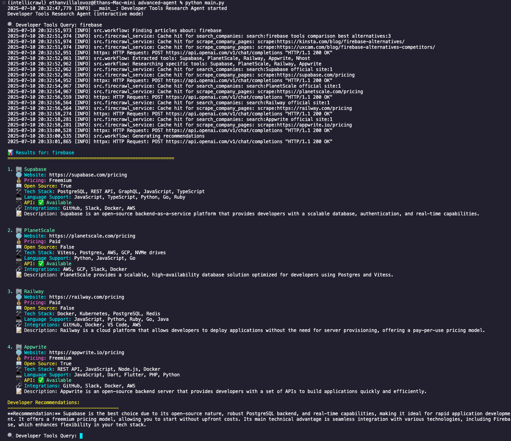
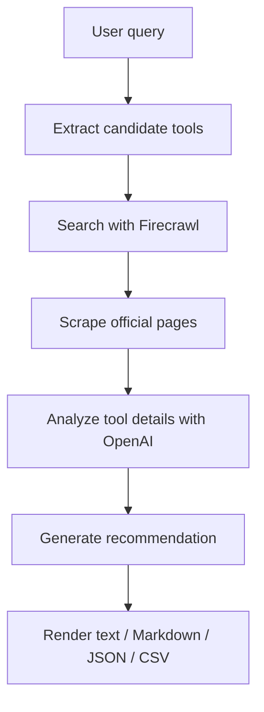

# IntelliCrawl

[](https://github.com/ethanvillalovoz/intellicrawl/actions/workflows/ci.yml)
[](LICENSE)
[](https://www.python.org/)
[](https://www.langchain.com/langgraph)
[](https://www.firecrawl.dev/)

IntelliCrawl is a web-powered AI research agent for comparing developer tools. It combines Firecrawl search/scraping, LangGraph orchestration, LangChain/OpenAI reasoning, structured Pydantic models, caching, and CLI output modes so users can research tool categories such as vector databases, CI/CD platforms, auth providers, hosting options, and developer APIs.



## What It Does

- Searches the web for articles and official pages related to a developer-tool query
- Extracts candidate tools from scraped content using an LLM
- Scrapes official tool pages for developer-facing details
- Produces structured comparisons with pricing model, open-source status, APIs, supported languages, integrations, tech stack, and short recommendations
- Supports interactive, single-query, and batch CLI workflows
- Outputs text, Markdown, JSON, or CSV
- Includes a smaller MCP-based prototype agent for Firecrawl tool experimentation

## Repository Status

This is a portfolio/research project, not a hosted production service. The advanced agent is the primary implementation. It requires live Firecrawl and OpenAI API keys for real research runs. CI intentionally validates deterministic code paths, models, docs, and syntax without calling external APIs.

## Project Layout

```text
.
├── advanced-agent/
│   ├── main.py                         # Primary CLI entry point
│   ├── requirements.txt                # Full runtime dependencies
│   ├── .env.example                    # Required environment variables
│   ├── docs/examples/                  # Example output screenshots
│   └── src/
│       ├── firecrawl_service.py        # Firecrawl search/scrape wrapper and cache
│       ├── logging_config.py           # Logging setup
│       ├── models.py                   # Pydantic result/state schemas
│       ├── prompts.py                  # Prompt templates
│       └── workflow.py                 # LangGraph research workflow
├── simple-agent/
│   ├── main.py                         # MCP-based prototype agent
│   ├── requirements.txt
│   └── .env.example
├── examples/                           # Sanitized sample Markdown, JSON, and CSV outputs
├── tests/                              # Lightweight deterministic tests
├── docs/                               # Architecture, usage, and FAQ
└── README.md
```

## Quick Start

Clone the repository:

```sh
git clone https://github.com/ethanvillalovoz/intellicrawl.git
cd intellicrawl
```

Create a Python environment:

```sh
conda create -n intellicrawl python=3.11
conda activate intellicrawl
python -m pip install --upgrade pip
```

Install the advanced agent:

```sh
pip install -r advanced-agent/requirements.txt
```

Create an environment file:

```sh
cp advanced-agent/.env.example advanced-agent/.env
```

Then fill in:

```text
FIRECRAWL_API_KEY=your_firecrawl_api_key
OPENAI_API_KEY=your_openai_api_key
```

Run the interactive CLI:

```sh
cd advanced-agent
python main.py
```

Run a single query:

```sh
cd advanced-agent
python main.py "vector databases" --output markdown
```

Save output directly to a file:

```sh
cd advanced-agent
python main.py "vector databases" --output markdown --output-file ../exports/vector-databases.md
```

Run batch mode:

```sh
cd advanced-agent
python main.py --batch queries.txt --output csv
```

## Output Modes

| Mode | Command | Use case |
| --- | --- | --- |
| Text | `python main.py "auth platforms"` | Human-readable terminal output |
| Markdown | `python main.py "vector databases" --output markdown` | Notes, docs, blog drafts |
| JSON | `python main.py "observability tools" --output json` | Downstream structured processing |
| CSV | `python main.py "cloud databases" --output csv` | Spreadsheet comparison |

Each format can be written to disk with `--output-file`. See [examples/](examples/) for sanitized sample outputs.

## Advanced Agent Workflow


```mermaid
flowchart TD
    Q["User query"] --> E["Extract candidate tools"]
    E --> S["Search with Firecrawl"]
    S --> C["Scrape official pages"]
    C --> A["Analyze tool details with OpenAI"]
    A --> R["Generate recommendation"]
    R --> O["Render text / Markdown / JSON / CSV"]
```

## Simple Agent

The `simple-agent/` folder is a smaller prototype that connects a LangGraph ReAct agent to Firecrawl MCP tools through `npx firecrawl-mcp`.

```sh
cd simple-agent
pip install -r requirements.txt
cp .env.example .env
python main.py
```

Use the advanced agent for the polished comparison workflow. Use the simple agent when experimenting directly with MCP tool calls.

## Development

Run lightweight tests:

```sh
pip install -r requirements-ci.txt
PYTHONPATH=advanced-agent pytest tests
```

Run syntax checks:

```sh
python -m compileall advanced-agent simple-agent tests
```

CI does not call Firecrawl or OpenAI. Keep live API experiments local unless a test is explicitly marked as an integration test.

## Examples

- [Markdown sample](examples/sample-output.md)
- [JSON sample](examples/sample-output.json)
- [CSV sample](examples/sample-output.csv)

## Documentation

- [Architecture](docs/architecture.md)
- [Usage Guide](docs/usage-guide.md)
- [FAQ](docs/faq.md)
- [Security Policy](SECURITY.md)
- [Contributing Guide](CONTRIBUTING.md)

## Roadmap

- Add mocked Firecrawl/OpenAI integration tests
- Add optional scoring/ranking rubric for developer tools
- Add richer batch summaries across multiple queries
- Add a small web UI once the CLI workflow is stable

## License

This project is released under the [MIT License](LICENSE).
