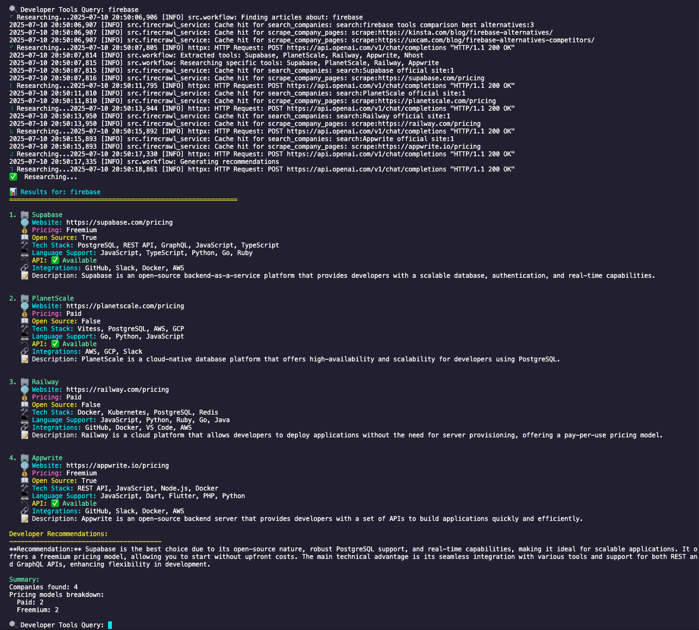

# IntelliCrawl: Autonomous AI Research Agent for Developer Tools 🚀


---

## Introduction

**IntelliCrawl** is an advanced multi-step AI research agent for autonomous web-powered knowledge extraction and developer tool comparison.

---

## CI/CD

This project uses **GitHub Actions** for automated CI/CD:

- **Continuous Integration (CI):** Installs dependencies and checks builds on every push and pull request.
- **Continuous Deployment (CD):** Automatically creates a GitHub release on every push to `main`.

You can view workflow status in the Actions tab of the repository.

---

## Description

IntelliCrawl leverages LangGraph, LangChain, and Firecrawl to automate the process of discovering, analyzing, and recommending developer tools. It supports batch, single, and interactive CLI modes, customizable output formats (text, markdown, JSON, CSV), and extensible workflows. Caching and async support ensure fast, efficient research.

---

## Visuals


<!-- You can use a Mermaid diagram or add screenshots/gifs here -->


---

## Prerequisites / Requirements

- Python 3.13+
- Conda (recommended)
- npm (for MCP/firecrawl-mcp)
- Firecrawl API key ([get one here](https://www.firecrawl.dev/))
- OpenAI API key ([get one here](https://platform.openai.com/api-keys))
- Node.js (for MCP integration)
- [colorama](https://pypi.org/project/colorama/), [yaspin](https://pypi.org/project/yaspin/), [diskcache](https://pypi.org/project/diskcache/)

---

## Technologies Used

- **LangGraph** (multi-step agent workflows)
- **LangChain** (LLM orchestration)
- **Firecrawl** (web scraping/search API)
- **OpenAI** (LLM for analysis)
- **MCP** (simple agent, optional)
- **Pydantic** (data models)
- **colorama**, **yaspin** (UX enhancements)
- **diskcache** (caching)

---

## QuickStart Guide

```sh
# Clone the repo
git clone https://github.com/ethanvillalovoz/intellicrawl.git
cd intellicrawl

# Create and activate environment
conda create -n intellicrawl python=3.13
conda activate intellicrawl

# Install dependencies
pip install -r advanced-agent/requirements.txt

# Set up .env file
echo "FIRECRAWL_API_KEY=your_key" > .env
echo "OPENAI_API_KEY=your_key" >> .env

# Run the agent (interactive mode)
python advanced-agent/main.py
```

---

## Advanced Usage

- **Batch mode:**  
  `python advanced-agent/main.py --batch queries.txt --output markdown`
- **Custom output:**  
  `python advanced-agent/main.py "vector database" --output csv`
- **Simple agent (MCP):**  
  `python simple-agent/main.py`

---

## Configuration

- `.env` file for API keys:
  ```
  FIRECRAWL_API_KEY=your_key
  OPENAI_API_KEY=your_key
  ```
- `requirements.txt`: Python dependencies.

---

<!-- ## Automated Test

```sh
# Run tests (if available)
pytest tests/
```

--- -->

## Roadmap

| Feature                | Status      |
|------------------------|------------|
| Async workflow         | ✅ Done     |
| Caching                | ✅ Done     |
| Customizable prompts   | ⏳ Planned  |
| Plugin architecture    | ⏳ Planned  |
| Web UI                 | ⏳ Planned  |
| More output formats    | ⏳ Planned  |

---

## Contribution

We welcome contributions!  
- Fork the repo and submit a PR.
- See [CONTRIBUTING.md](CONTRIBUTING.md) for guidelines.
- Please add tests for new features.

---

## Folder Structure

```
intellicrawl/
├── advanced-agent/
│   ├── main.py
│   ├── src/
│   │   ├── workflow.py
│   │   ├── firecrawl_service.py
│   │   ├── models.py
│   │   ├── prompts.py
│   │   └── logging_config.py
│   ├── requirements.txt
├── simple-agent/
│   └── main.py
├── docs/
├── .env
├── .gitignore
├── LICENSE
└── README.md
```

---

## FAQ / Troubleshooting

- **API rate limit:** Wait or upgrade your Firecrawl plan.
- **Missing API key:** Check your `.env` file.
- **npm not found:** Install Node.js and npm.

---

## License

MIT License

---

## Maintainers & Contributors

See [CONTRIBUTORS.md](CONTRIBUTORS.md) for a full list.

---
