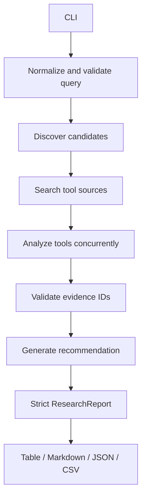
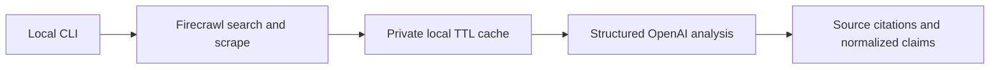

# Architecture

IntelliCrawl has one research pipeline and two provider assemblies. Demo mode supplies deterministic providers; live mode supplies Firecrawl and OpenAI providers. Both modes pass through the same LangGraph nodes, models, evidence checks, and renderers.

## State Flow

`ResearchPipeline` compiles three LangGraph nodes:

1. `discover` finds public comparison material and asks the analysis provider for a bounded, deduplicated tool set.
2. `research` searches each tool concurrently, normalizes its profile, and retains warnings for missing or failed profiles.
3. `recommend` synthesizes the validated profiles. If synthesis fails, the report remains usable and records the failure.

The graph only fails completely when it cannot produce any sourced tool profile.

## Provider Contracts

`SearchProvider` returns normalized `SourceDocument` objects. `AnalysisProvider` selects tools, builds structured profiles, and produces a recommendation. The graph depends on these contracts rather than a specific SDK.

| Assembly | Search | Analysis | Purpose |
| --- | --- | --- | --- |
| Demo | deterministic fixture | deterministic fixture | evaluation, docs, and tests without keys |
| Live | Firecrawl Python SDK | OpenAI structured output | current public-web research |

Optional live dependencies are imported lazily, so installing the base package is sufficient for the demo.

## Evidence Model

Each tool profile contains:

- normalized fields such as pricing model and API availability
- field-level evidence records with source IDs
- a bounded source list with titles and public URLs
- a `complete` or `partial` status

Pydantic rejects extra fields and evidence that references an unknown source ID. Full scraped content is available to the analysis provider but excluded from serialized `ResearchReport` output.

## External Data Boundary

Firecrawl results are normalized before entering the graph. Source URLs must use HTTP or HTTPS and cannot target obvious local, credential-bearing, private, or reserved addresses. Search and scrape calls have explicit timeouts and bounded concurrency.

The cache key is a SHA-256 digest of the normalized search request. Cached records may contain scraped page content and therefore remain outside version control. Exports contain citations, not the private scraped body.

## Failure Semantics

- Empty discovery results stop the run rather than create an unsupported report.
- A failed tool profile becomes a warning while other profiles continue.
- Fields without valid source evidence make a tool partial.
- A failed recommendation produces a neutral fallback and a warning.
- Output files use write-then-replace semantics so interrupted writes do not leave partial reports.

## Package Map

| Module | Responsibility |
| --- | --- |
| `cli.py` | arguments, exit codes, and output routing |
| `pipeline.py` | LangGraph state and orchestration |
| `contracts.py` | provider protocols |
| `providers.py` | Firecrawl normalization, URL validation, timeouts, and caching |
| `live.py` | live provider construction and OpenAI structured output |
| `demo.py` | deterministic no-key implementation |
| `models.py` | strict schemas and evidence invariants |
| `prompts.py` | source-aware prompts and untrusted-content guardrails |
| `renderers.py` | safe terminal, Markdown, JSON, and CSV output |

## Verification Boundary

Tests cover the graph, adapters, prompts, models, cache behavior, CLI exit paths, and renderers with deterministic fakes. CI does not call Firecrawl or OpenAI. Run an explicit live smoke test when changing provider behavior, and record only sanitized output.
