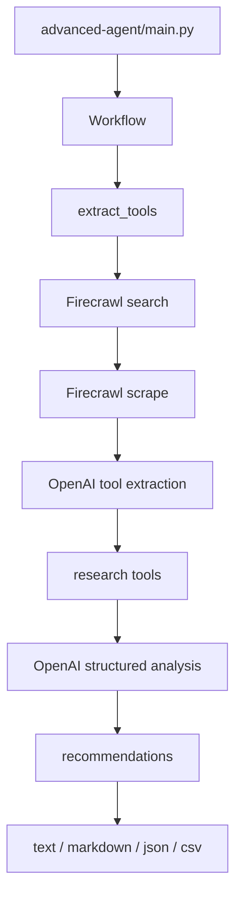

# Architecture

IntelliCrawl contains two related agents:

- `advanced-agent/`: the primary CLI workflow for structured developer-tool research.
- `simple-agent/`: a smaller MCP prototype that exposes Firecrawl tools to a LangGraph ReAct agent.

## Advanced Agent

## Key Modules

| File | Role |
| --- | --- |
| `advanced-agent/main.py` | CLI parsing, interactive loop, batch mode, output rendering |
| `advanced-agent/src/workflow.py` | LangGraph state machine for extraction, research, and recommendation |
| `advanced-agent/src/firecrawl_service.py` | Firecrawl search/scrape wrapper with disk-backed caching |
| `advanced-agent/src/models.py` | Pydantic models for company analysis, company info, and workflow state |
| `advanced-agent/src/prompts.py` | Prompt templates for extraction, analysis, and recommendations |
| `simple-agent/main.py` | MCP-based prototype using `npx firecrawl-mcp` |

## Data And Cache Policy

Firecrawl cache directories are generated locally and ignored by git. They can contain scraped web content and should not be treated as source files. Example environment files are tracked, but real `.env` files are ignored.

## External Boundaries

The advanced agent depends on live Firecrawl and OpenAI APIs for end-to-end behavior. CI validates deterministic code paths and syntax only; live integration testing should be run manually with explicit API keys.
